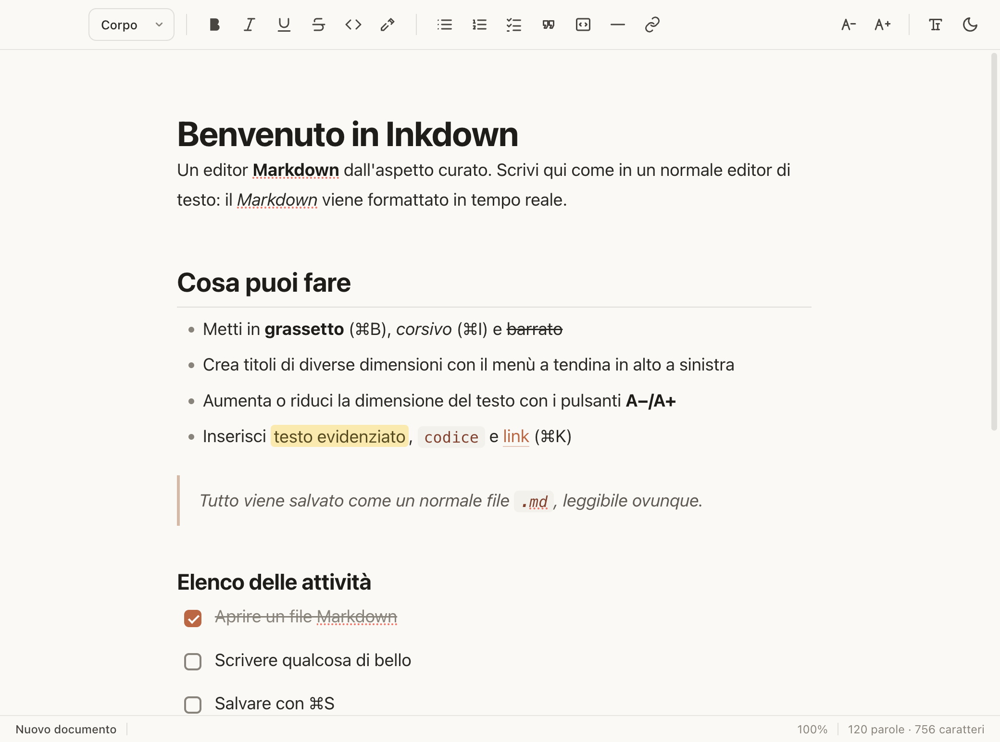
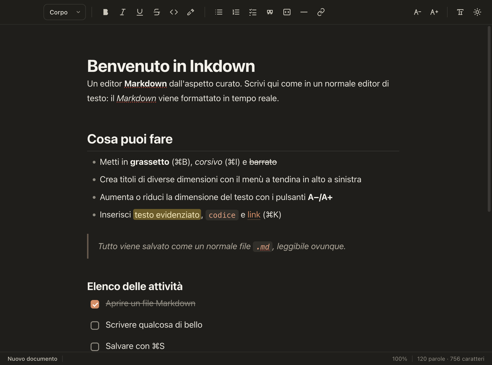

# Inkdown

Un editor di file **Markdown** per macOS dall'aspetto curato - pensato per scrivere
e leggere `.md` con la stessa eleganza tipografica degli artifact di Claude.

<p align="center">
  
  
</p>

**[⬇️ Scarica l'ultima versione](../../releases/latest)** - DMG universale per Mac
**Intel** e **Apple Silicon**. Vedi [Scaricare l'app](#scaricare-lapp) per l'installazione.

## Cosa sa fare

- **Formattazione visiva in tempo reale** (WYSIWYG): vedi grassetto, corsivo, titoli,
  liste, citazioni e codice già formattati mentre scrivi, non i simboli `**` o `#`.
- **Barra strumenti** con: stile del paragrafo (Corpo / Titolo 1-4), **grassetto**,
  *corsivo*, sottolineato, ~~barrato~~, codice, evidenziatore, elenchi (puntato,
  numerato, attività con caselle), citazione, blocco di codice, linea, link.
- **Dimensione del testo** regolabile con i pulsanti **A− / A+** (o ⌘− / ⌘+), con
  indicatore percentuale nella barra di stato.
- **Tema chiaro e scuro** e scelta del carattere (sans / serif).
- **Apre e salva veri file `.md`** - niente formati proprietari. Avvisa prima di
  scartare modifiche non salvate.
- **Trova e sostituisci** (⌘F): conteggio risultati, precedente/successivo,
  sensibilità maiuscole, sostituisci singolo o tutti.
- **Esporta in PDF** (⌘P) con la stessa formattazione elegante che vedi a schermo.
- Tabelle, blocchi di codice con evidenziazione della sintassi e **pulsante "Copia"**,
  immagini, caselle di spunta. **⌘-clic** su un link per aprirlo nel browser.
  Trascina un file nella finestra per aprirlo. La finestra ricorda posizione e dimensione.

## Scorciatoie principali

| Azione | Tasti |
| --- | --- |
| Nuovo / Apri / Salva | ⌘N · ⌘O · ⌘S |
| Salva con nome · Esporta PDF | ⇧⌘S · ⌘P |
| Trova e sostituisci | ⌘F |
| Grassetto / Corsivo / Sottolineato | ⌘B · ⌘I · ⌘U |
| Codice / Evidenzia | ⌘E · ⇧⌘H |
| Titolo 1 / 2 / 3 · Corpo | ⌘1 · ⌘2 · ⌘3 · ⌥⌘0 |
| Link (⌘-clic per aprire) | ⌘K |
| Aumenta / Riduci testo | ⌘+ · ⌘− |
| Tema chiaro/scuro · Carattere | ⇧⌘L · ⇧⌘F |

## Scaricare l'app

Scarica l'ultima versione dalla pagina **[Releases](../../releases/latest)**:
`Inkdown-x.y.z-universal.dmg` (universale, gira su Mac **Intel** e **Apple Silicon**).

1. Apri il DMG e trascina **Inkdown** nella cartella **Applicazioni**.
2. L'app non è notarizzata da Apple, quindi al primo avvio macOS 15 / 26 la blocca.
   Fai doppio clic, premi **Fine**, poi apri **Impostazioni di Sistema → Privacy e
   sicurezza**, scorri in fondo e clicca **"Apri comunque"** e conferma.
   In alternativa, nel **Terminale**:
   ```bash
   xattr -dr com.apple.quarantine /Applications/Inkdown.app
   ```

Le stesse istruzioni sono nel file **"Leggimi - Prima apertura"** dentro il DMG.

## Distribuire / creare un DMG

Per rigenerare il DMG dopo aver modificato l'app:

```bash
bash scripts/make-dmg.sh
```

Lo script costruisce in una cartella locale (fuori da iCloud, per evitare errori
di hdiutil), firma ad-hoc in profondità l'intero bundle e ricrea il DMG firmato,
**universale** (Intel + Apple Silicon).

L'app non è notarizzata da Apple (la notarizzazione richiede un account
sviluppatore a pagamento, ~99 €/anno), quindi chi la riceve segue la stessa
procedura di [prima apertura](#scaricare-lapp). Solo la notarizzazione eliminerebbe
del tutto l'avviso di macOS al primo avvio.

## Per gli sviluppatori

Stack: **Electron** + **Vite** + **TipTap** (ProseMirror) con `tiptap-markdown`.

```bash
npm install          # installa le dipendenze
npm start            # build del renderer + avvio in sviluppo
npm run icon         # rigenera build/icon.icns
npm run pack         # crea release/mac-arm64/Inkdown.app
```

Struttura:

- `electron/main.js` - processo principale: finestra, menu, dialoghi apri/salva, file `.md`.
- `electron/preload.js` - ponte sicuro (contextBridge) tra interfaccia e processo principale.
- `src/` - interfaccia: `index.html`, `style.css` (la tipografia), `main.js` (editor TipTap).
- `scripts/make-icon.mjs` - genera l'icona dell'app.

### Nota sull'avvio in sviluppo

In alcuni terminali (es. integrato in VS Code) la variabile `ELECTRON_RUN_AS_NODE=1`
è attiva e impedisce ad Electron di avviarsi come app. Avvia così:

```bash
env -u ELECTRON_RUN_AS_NODE npm start
```
